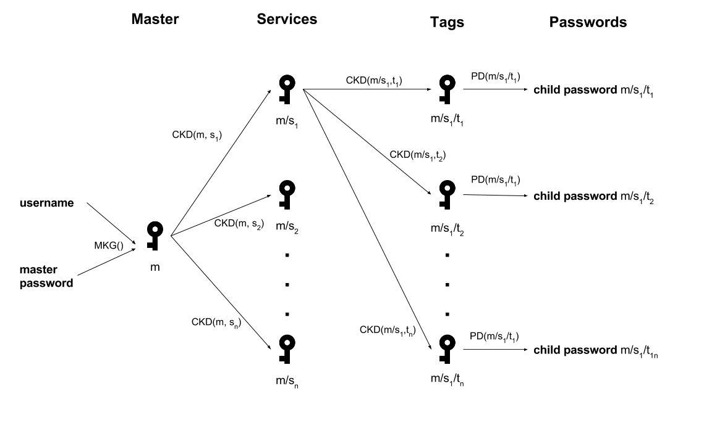

# GeniPass-Android
GeniPass is a deterministic password manager that uses child key derivation cryptography to securely derive your passwords at runtime. What does this mean? It means GeniPass uses math to "load" (calculate) your passwords rather than store them in a database or on some server. Generated passwords consist of 6 words chosen randomly from a word list and have greater than 100 bits of entropy. You can download the app from the [Play Store](https://play.google.com/store/apps/details?id=xyz.jamescarroll.genipass) or grab the apk directly from [Github](https://github.com/jamcar23/GeniPass-Android/releases) or [XDA](http://forum.xda-developers.com/showpost.php?p=65116257&postcount=2).

<!-- START doctoc generated TOC please keep comment here to allow auto update -->
<!-- DON'T EDIT THIS SECTION, INSTEAD RE-RUN doctoc TO UPDATE -->
**Table of Contents**  *generated with [DocToc](https://github.com/thlorenz/doctoc)*

- [Usage](#usage)
- [Key Generation](#key-generation)
  - [Conventions](#conventions)
  - [Extended Keys](#extended-keys)
  - [Master Key Generation (MKG)](#master-key-generation-mkg)
  - [Child Key Derivation (CKD)](#child-key-derivation-ckd)
- [Passwords](#passwords)
  - [Random Generation](#random-generation)
  - [Key Derivation](#key-derivation)
- [Key Tree](#key-tree)
- [Security](#security)
- [Test Vectors](#test-vectors)
  - [Vector 1](#vector-1)
  - [Vector 2](#vector-2)
  - [Vector 3](#vector-3)
  - [Vector 4](#vector-4)
  - [Vector 5](#vector-5)
- [License](#license)

<!-- END doctoc generated TOC please keep comment here to allow auto update -->

## Usage 

GeniPass uses an username, master password, service, and tag. The service is name of the service for the password you want (i.e, Github) and the optional tag allows you to generate more than one password per service. Tip, for best practices don't make your username for GeniPass or any tag any common username you use (if people know you by that and it's easy to guess you probably shouldn't use it.) 

## Key Generation
### Conventions 

In the rest of this text I assume knowledge and understanding of one-way hash functions and key derivation functions. Knowledge in elliptic curve cryptography is helpful as I use the base point from ECDSA curve [secp256k1](http://www.secg.org/sec2-v2.pdf) to calculate the public keys. 

Concatenation (denoted ||) is the operation of appending one byte sequence to another. Xor (denoted ^) is the operation that outputs a byte sequence who's bits are true when both inputs differ (one is true the other is false.)

As standard convention functions, I assume:

* point(i): returns the x coordinate resulting from EC point multiplication of the secp256k1 base point with integer i
* parse(i): interprets a 32 byte sequence as a 256 bit number, big endian
* ser(i): encodes integer i into 32 byte sequence, big endian 
* ripemd(s): returns the RIPEMD-160 hash of s 
* sha3(c): returns the hash of c iterated through SHA3-256, 256 times hashing c twice per iteration for a total of 512 times. Before hashing c the first time one byte, containing the number of iterations (0, 1... 255), is append to c.
* hmac(_k, d): returns the HMAC-SHA2-512  hash where _k is the key and d is the data

The RIPEMD-160 function is specified [here](https://homes.esat.kuleuven.be/~bosselae/ripemd160.html).

The SHA-3 function is specified in [FIPS 202](http://nvlpubs.nist.gov/nistpubs/FIPS/NIST.FIPS.202.pdf)

The HMAC-SHA2-512 function is specified in [RFC 4868](https://tools.ietf.org/html/rfc4868).

### Extended Keys

In what follows, I will define a function that derives two generations of child keys from a parent key in order to derive a passphrase from the 2nd generation child key. Rather than derive the child directly from the key, the key is extended with 256 bits of entropy, called the chain code. The private and public keys do not share the same chain code. 

Extended private keys are denoted (k, c) where k is the normal private key and c is the private chain code. Extended public keys are denoted (K, C) where K = point(k) and C = sha3(c). K is in the compressed format, meaning it's only the x coordinate.

### Master Key Generation (MKG)

Below are the steps to generate the master private and public keys based on the username (denoted u) and master password (denoted mp). Genipass will not accept master passwords having less than 100 bits of entropy. 

* SCrypt returns a 64 byte sequence, denoted as b, using the following: 
	* P: ripemd(u) || ripemd(mp)
	* S: ripemd(u) ^ ripemd(mp) 
	* N: 216
	* r: 8
	* p: 2
* Split b into two 32 byte sequences, bL and bR
* The returned master public key K is ser(point(parse(bL)))
* The returned master public chain code C is sha3(bR)
* (At this point the master private is discarded as it is no longer needed.) 

### Child Key Derivation (CKD)

Given a parent extended public key (denoted (Kp, Cp) where p means parent) and a string (denoted s where s is either the service or tag depending on whether its the second or third generation key respectively), it is possible to calculate a child public key using the steps below: 

* Let b = hmac(Cp, s)
* Split b into two 32 byte sequences, bL and bR
* The returned child public key K is ser(point(parse(bL)))
* The returned child public chain code C is sha3(bR)
* (At this point the child private is discarded as it is no longer needed.)

## Passwords
GeniPass's passwords are created by looking up words on a specific line in a word list. The master password and all generated passwords must have greater than 100 bits of entropy. There are two ways to create a password as described below: 
### Random Generation 

GeniPass can generate a strong master password from random bytes. Steps are creating a random master password are as follows:

* Get 16 random bytes from /dev/urandom (using SecureRandom)
* Split bytes into 16 bit numbers 
* Look up each number in a word list 
* Add each word to password 
* Return password

 
### Key Derivation 

Given a second generation extended public key (K, C) it is possible to derive a password from the normal public key (K). The steps for password derivation are as follows:

* Remove first byte constant from K
* Split K into 16 bit numbers 
* Look up each number in a word list 
* Add each word to password 
* Return password

## Key Tree

Above is the visual representation of key generation and password derivation. MKG() is defined in [Master Key Generation](#master-key-generation), CKD() is defined in [Child Key Derivation](#child-key-derivation), and PD() is defined in [Key Derivation](#key-derivation). 

For shorten notation I write CKD(CKD(m, sn), tn) as m/sn/tn All keys passed in CKD() are the public chain code. For both sn and tn n is any string entered by the user. 

Each leaf node in the tree corresponds to an actual public key (x coordinate on the curve), while the internal nodes correspond to the location of the branch needed to derive the leaf. The chain codes of leaf nodes are ignored as only their public key is needed to derive the password. 

## Security 
In addition to the expectations from the EC public-key cryptography itself:

* Given a public key K, an attacker cannot find the corresponding private key more efficiently than by solving the EC discrete logarithm problem (assumed to require 2128 group operations).

the intended security properties of this cryptosystem are: 

* Given an extended public key (Ks, Cs) and the string s, an  attacker cannot find the extend parent key (Kp, Cp) more efficiently than a 2256 brute force of HMAC-SHA2-512.
* Given any number of (string, extended public key) tuples (st, Kst, Cst) with distinct st's, determining whether they are derived from a common parent extended public key (i.e, whether there exist a (Kp, Cp) such that for each t in (0...N-1) CKD((Kp, Cp), st) = (Kst, Cst) cannot be done more efficiently than a 2256 brute force of HMAC-SHA2-512.
* Given a public chain code C an attacker cannot find the corresponding private chain code more efficiently than a 2128 brute force of SHA-3 256. 

## Test Vectors 
All keys/crypto outputs are in hex; the username, master password, service, tag, and generated passwords use the regular alphabet. 

NOTE: quotes ("") are used to denote the beginning and end of a string of input text or generated passwords and should not be included in the test. Watch the spaces in the passwords

All vectors use the following:

* username (u): "" (empty string)
* RIPEMD-160(u): 9C1185A5C5E9FC54612808977EE8F548B2258D31

### Vector 1

* Master Password (p): "immortal finnish dionaea cubical appallingly tips "
* RIPEMD-160(p): 62AD42D40B7F1488EEDD17354D3969123B9B84A3
* Service: "facebook"
* Tag: ""

* Master:
	* Extended Private:	161A425B46B34DD11E63C7F16A5B1BD44D604C2AD61237FE93F14BF1B37D2CC3900909EE32E4DD003D43CDCD805F4E41F20456A4BD9501814F5798A767EDF009
	* Extended Public:
023E5C898158CA6A87C3334E28044EF6946AEFA05F9CE79D453497665700D3B235DA60AC1FF74AEDF9AA30DE64994508D8B0769A07D9DE18B75C1025E38083684DFF
* First Child:
	* Extended Private:
75FAECDA96D8084AADA01891D7FEC0E6872EC3A2F56C745B590856337F90A92D3D332FC43EE8545D2271CAECB746283912FF88A1A74D26F4B3B87374049B725B
	* Extended Public:
038F4E1BA44C0F066C8E72134D661F6C0B5AB98FD2FC953AF084979C2AF5C73D7D4D66CAF737D0FE8063D09E6320BFB3424C18043EF21799E36CB012C7A295FD93FF	
* Second Child:
	* Extended Private:
35459DD3FCDC7D91A4AF47FE075CF3E8211D36430D2817FB935ECA1A0D6B923F3A45C7980AEAF2109F8F2AA1ED377F9C93B6D863980064A6B559267FC2D251A7
	* Extended Public:
028676F28117B36EE62D6B4213B8CC35C68F87228BC21E45F73C5BB0D5E9FE8C65ACDE93AF47185CC83A270A4E320595FB7CA8338173DF5F5FD802E8767303F1D3FF
* Generated Password: "gaskin slummock parasympathomimetic bashbazouk redbone canine "

### Vector 2

* Master Password (p): "autochthonous perdu gecko buckskin silliness thysanoptera "
* RIPEMD-160(p): D1C6D372AD3BDAB0001E5200F77A67AC61E87733
* Service: "github"
* Tag: "alpha" 

* Master:
	* Extended Private:
D26154E586CC1573DB8D45C39FAF6EE1BAAC0682B391F119ADA655BB3424F05A3B2AE478B03798BD7B431FCA2BEC5AB483E6F8A2707B5113B26C2F08FDAD49E1	
	* Extended Public:
03FBF569FD278B7C9A5178F2954081AC1128FF9C0E38ACCFDD376647E84B455E6389A746F81A4DDB62D72AADA8D3C1828732CB11F2468871B696CDC534A14B6CFEFF
* First Child:
	* Extended Private:
1D14151500F036880B5E670ED0ADDA6B844E74643F9A03107A62D04F461F377C34EB6209C1EE638F1753838D02C91C6B55D6EDE2F34C3D6B3BCB62F89DDC8E11
	* Extended Public:
029459AFB95F249071848BF9D9A6CBCC0CD474829FE9703335E67DCAA145A4FF9F0F38E9E79C3F6A004DD6B1DE25007A4F1369A9C4C6DEBB7EB64ADCB5FCD017B3FF	
* Second Child:
	* Extended Private:
87681AC010C481A98F4BA11C5C8891B56D61D255329CF9D56361220277FA34EBFAE865082680C3F26075A78644A66B9BBB33306173D2B7000D0FA2A9ACE8DB5E
	* Extended Public:
02241A9CDD7972F55F2B2087F0AE98AC26F68745B8215C746F3A61FF2D868C9ED8E9741FC956529972C8E8147047B13BC83A6E5C41E7C225581E243212C370BCC6FF
* Generated Password: "ses homophonic regulate empetrum hilariously stuffy "

### Vector 3

* Master Password (p): "dyaus titillate roulade appelidage disputation penitentiary "
* RIPEMD-160(p): 4CC2317A7711E2749840F241CC199DFD01F20FC0
* Service: "google"
* Tag: "main"

* Master:
	* Extended Private:	
856B01418DA137AD11E62E8AB4413002D5700CA24A99FC187DFCB31935A393B4CB6AD766DF7B343F6DCC3C2C2C8B6F3494457B80ED9D6DE3469D0CE7A792D2E8
	* Extended Public:
0321B2B57BA8A61D28B302051E5F2FAAD36A9913696EF907FA6AB08EB482CFC78466349185AAC199F7DBC020841702ECAA6488543338C0D3C22A61DB622BB88C9AFF
* First Child:
	* Extended Private:
3AF7D524576CA9851B69F41D7A67B5E8F23EF9DEB4E47228C81C127EB519A4AA84586F232F2B366CAF6143C44950B893C455DEF9B9A9E502D4F6A1A433595BEA
	* Extended Public:	
03AD27F744275B41F7BB4585433654261FB16E89B19A79B4ECBF4F3424703D693A34ED16BE63B9F1B341167F8C7691A2BBA3B730CE3BD112495DB4B267359820CEFF
* Second Child:
	* Extended Private:
D5ECBE0300C0470F5D60E57AB132562D01652B22EBC6D16BA7EF53A6E66AF14D2132ED9CF00A4C7901A7E29D0C9F63E0B4969F9868F8190EF50F8E1357CF0FE7
	* Extended Public:
02E3CDC8A98F8A7AA96CF97225719625054A28C05AB0F6EAD53C31E654D52A019BEBD88207F3D316139E472C4452488226BF112E14F20712B8522D91DAD8FAFE46FF
* Generated Password: "monario seraphina alimentative sauerkraut atropidae dictyoptera "

### Vector 4

* Master Password (p): "chronological malady denim drip existing hellenic "
* RIPEMD-160(p): 9286A8FB85F51AC9CA48B63DB753120361D271DA
* Service: "Twitter"
* Tag: "Some tag"

* Master:
	* Extended Private:	
2694AB6159892BA08FE00B9DEEE40500749109C1A700C86320986CEEAD5F21F718FDBCB73CAE23DBCB2BF813C902642DF86FF2B88615D11135D995D3C8814158
	* Extended Public:
03FEE0776316EB04741405DCA6EA6C1D8A1C33BDAF44578DFF8D0FCEB0EDACB4E163A540DE545D54AD41B996301903A88F1B0C89C820CF484E28B03E3E58E6B5A9FF
* First Child:
	* Extended Private:
31FB366637BD14F3533C1A8D2AE380FC8499444CE7A0C38C3EA126430AC5B3C799ABAF09E51AA7B891BF267FF65FF9FB828BF7651125E23D4FB2BD91A6DD91CA
	* Extended Public:	
03551EF9F371837EF8DAD63F22711BEDF7DB8F6712B8A31AAF69C3202F2ADDDD626568E7D3B1E1FA8B1E024B364C7F59BC57A7F937D80542109480C774292F06F3FF
* Second Child:
	* Extended Private:
1B635285810DC162214796F06D5F3295F064E9C652D843C3DA70E174F2D6DFC9F0403B4E9EC3637DD0A63FF57D1F6BC7D098B1DF7F87D27D2D3F5D0A07E1E5FA
	* Extended Public:
02EBED89A73DAF74F71E9E53EF62A4F974F42873FC6FE5B33A8EB3F96D3CD9936814770081FC5B756493209B3448DFBB64A9FA8670CA4835306E1A42AD60640F01FF
* Generated Password: "glassblower hypobetalipoproteinemia ischiagra fastened gadoid bouncer "

### Vector 5

* Master Password (p): "louisiana ni-resist baltimore saprophyte guerilla blintz "
* RIPEMD-160(p): 1EA84C088D70C999F8760AC4B7192F0AD5B06EEB
* Service: "Another site"
* Tag: ""	

* Master:
	* Extended Private:	
2349041D0E66A0CDF9FBD290838040141B13D5EC3676A23E3EF95A9994771CFEC43256134BF78DDFDBB47C706DB01C8483B0EC536F6D7249DFD0F4E5B73987B8
	* Extended Public:
02FD06F69218771D891319A1768ADA3547A27E1838F79001CD8B4BA7E377D57AB6F553FD2E7CBF22069BAC6E0B3146AE879670593B60BD04C001229E579E9EE65EFF
* First Child:
	* Extended Private:
92EC2A37A008D96B4E6DC42F063E3B6F7D0E90B7681F1C86D33791841EB09B76BC7B69766450CA55558C0A9FEE28089D3D049D6F1930AF8C4168DEC2AE08D530
	* Extended Public:	
03E09FC8E717B8F465ABC831CEB592CFBFB8312396FB7BB6158FFA34EB9E91CB3E2F53029A646BD6E55F9CEEE4534274F302A50BA5E8D93216016F82D0B8961B3FFF
* Second Child:
	* Extended Private:
96771A742773BD6A6A8FA7AF5AD32F8BB43CB30E0D3A91117C422AF0035A00A58C7FC811397085A0FC19B820CC96CE46FBCF5E0DA8D95A108BFD1919521CA3AA
	* Extended Public:
03045AD1EB18AE1A625DED5EB2E990DAC9DCCBC17B1C4D2BFA94A4AED7E2E0282C8FD175DA772328F63DC2C943B9241988FC592373F225C1FEC346483D947D6FE0FF
* Generated Password: "char salis ship-breaker brydges trafalgar pure "

## License 

Copyright (c) 2015, 2016 James Carroll

The full license is available in the [license](LICENSE) file.

GeniPass is free software: you can redistribute it and/or modify it under the terms of the GNU General Public License as published by the Free Software Foundation, either version 3 of the License, or (at your option) any later version.

GeniPass is distributed in the hope that it will be useful, but WITHOUT ANY WARRANTY; without even the implied warranty of MERCHANTABILITY or FITNESS FOR A PARTICULAR PURPOSE.  See the GNU General Public License for more details.

You should have received a copy of the GNU General Public License along with GeniPass.  If not, see <http://www.gnu.org/licenses/>.